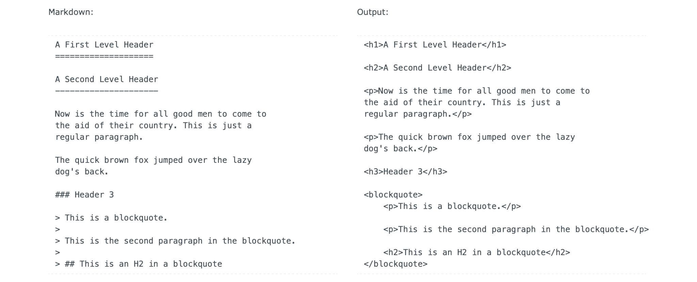

Many projects begin with writing — either while finding the core poetics or mythology of a project, or directly as the central media of the project as in an interactive narrative (cf. below). Masters students also have to write a text-based thesis, and as such, choice of your writing tools is important. Although it is a university standard (especially for research documents), Microsoft Word and even LibreOffice are often the wrong tools for almost any interaction design document, media design thesis, or digital art & design research project.

### Markdown
[Markdown](https://fr.wikipedia.org/wiki/Markdown) gets it's own category.

Stop using Word for writing your documents. Use Markdown. You are welcome.

Markdown is not software, it is more of a standard for writing text, and can be used in many different tools, websites, and APIs.

Markdown was originally designed for bloggers wishing to keep their text clean on their end (writer-oriented design tools), but with the possibility of easily converting said text into web pages with all the advantages that structured hypertext allows. From this original use-case, the simplicity and elegance of Markdown has allowed it to evolve into *the* de-facto, default format for all sorts of text documents: blogs, essays, chat discussions (cf. [Discord](https://support.discord.com/hc/en-us/articles/210298617-Markdown-Text-101-Chat-Formatting-Bold-Italic-Underline-)), documentation, and so on.

Markdown was designed to be easily transformed into whatever final format you need to export to: .doc, .txt, .html, .pdf, .epub, etc. (cf. Pandoc, below).

Here are some tools you can use to write pure markdown:

- [VS Code](https://code.visualstudio.com) (see (tutorial:code link:tools/code))
- [Hedgehog Doc](https://hedgedoc.org) \*
- [HackMD](https://hackmd.io) \*
- [iA Writer](https://ia.net/writer)
- [Typora](https://typora.io)

\* Both Hedgehog and HackMD are collaborative online tools, similar to Google Docs.

Since the rest of this list contains a gazillion solutions to using [VS Code](https://code.visualstudio.com), and since VS Code is free, you should probably just write your Markdown in VS Code.

### Pandoc
By using a command-line tool (cf. (tutorial:Terminal link:tools/code)) such as [Pandoc](https://pandoc.org), you can convert your Markdown texts to and from all sorts of formats: .doc, .otf, .pdf, .epub, etc.

1. [Install Pandoc](https://pandoc.org/installing.html) using the installer. Make sure to follow the instructions for adding LaTeX into your installation of Pandoc for whatever platform you are using. LaTeX will allow us to generate PDF files from Markdown
2. Create a simple Markdown text file (cf. [Getting Started](https://pandoc.org/getting-started.html)) in whatever text editor you prefer (cf. (tutorial:VS Code link:tools/code)), and save it as `NameOfTextFile.md`
3. Open your Terminal (cf. (tutorial:Terminal link:tools/code)) into the folder of your text file
4. Type `pandoc NameOfTextFile.md -o NameOfTextFile.pdf`
	
Voilà, you now have a powerful workflow for writing your master's thesis. Here, for example, is [Mathilde Buenerd's Masters Thesis](https://github.com/mathildebuenerd/master-thesis-autocomplete) with instructions for the tools and workflow she designed to write and publish it.

Important note: in this Markdown > Pandoc > ________ approach, you will design the typography and layout using Cascading Style Sheets (CSS) — the format for designing web pages. This does not mean that your project is screen-based only; CSS can be used in print-based layout and typography.
