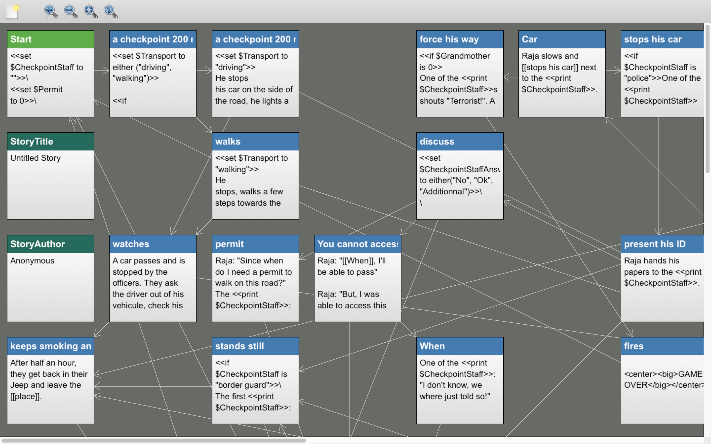
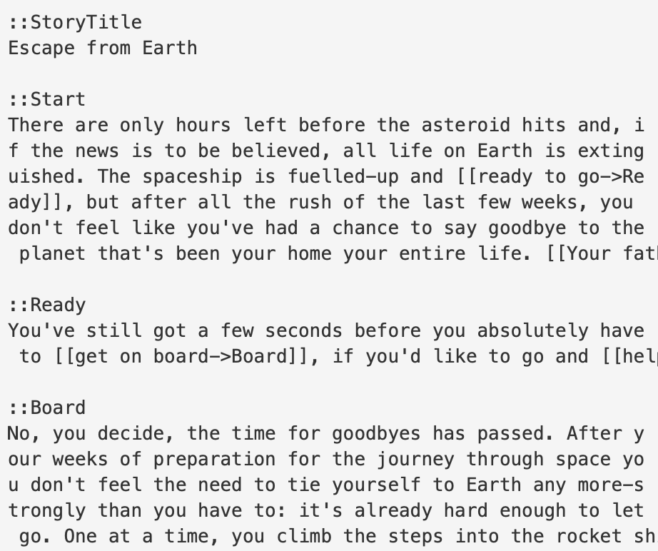
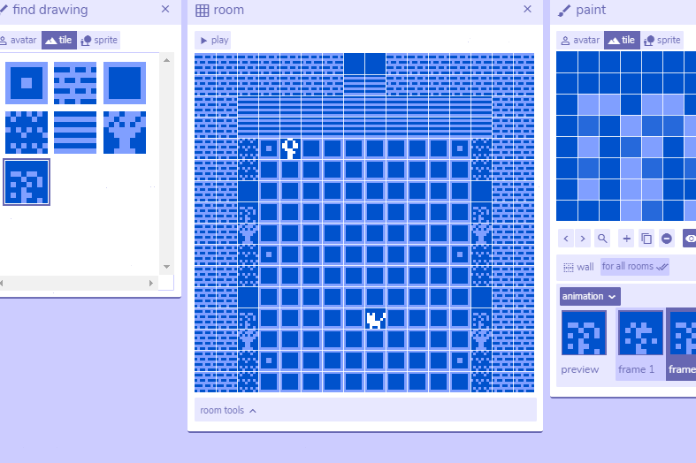
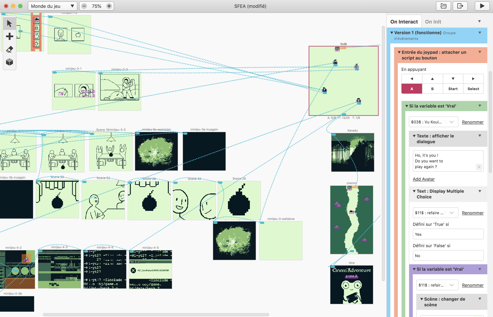

### Twine
Twine is a tool for making non-linear interactive text-based stories. It is a great tool for getting started with interactivity. At some stage of each narrative project, we almost always prototype at least some part of our interactive stories in Twine. Twine is the best and fastest way to learn interactive branching narrative.

<https://twinery.org>

Twine comes with a branching, node-based visual tool.

### Twee
Once we have used Twine to quickly find our voice, we either move to another tool, such as Fungus (cf. below), or design a more sophisticated story using Twine itself, or its pure text-based variant, named Twee:

<https://www.motoslave.net/tweego/>

The best way to write text-only Twee stories is from within (tutorial:VS Code link:tools/code).

### Bitsy
Bitsy is an even simpler tool than Twine to make interactive narratives, although in this case, the story format is that of a pixel-based adventure game. [Bitsy](https://ledoux.itch.io/bitsy)

### GB Studio
Another amazing open-source tool for interactive storytelling is GB Studio, which was designed for creating fully working interactive narratives on classic Gameboy and Gameboy Color consoles, but can also be exported directly for the web: [GB Studio](https://www.gbstudio.dev).

Following the invocation by [100 Rabbits](https://100r.co/site/home.html) to only use already-built technologies, GB Studio is a working solution for telling stories using both old and new hardware. If you integrate the webpage export into a native iOS or Android app wrapper, you can even distribute your story/game on a smartphone, tablet or smart TV (cf. Web App).

### Fungus
Fungus is a free, open-source plug-in for (tutorial:Unity link:tools/3d-graphics) that you can download via the Unity Asset Store.

[Fungus](https://assetstore.unity.com/packages/tools/game-toolkits/fungus-34184)

It is an entirely visual node-based programming tool, meaning you can design interactions using a system of interconnected visual "blocks" instead of writing text-based code.

Fungus is a fun way to start learning Unity and works well for youth-workshop introductions to 2D game creation in Unity. With very little basic knowledge of Unity you can get a lot done with Fungus.

(vimeo:603217221)